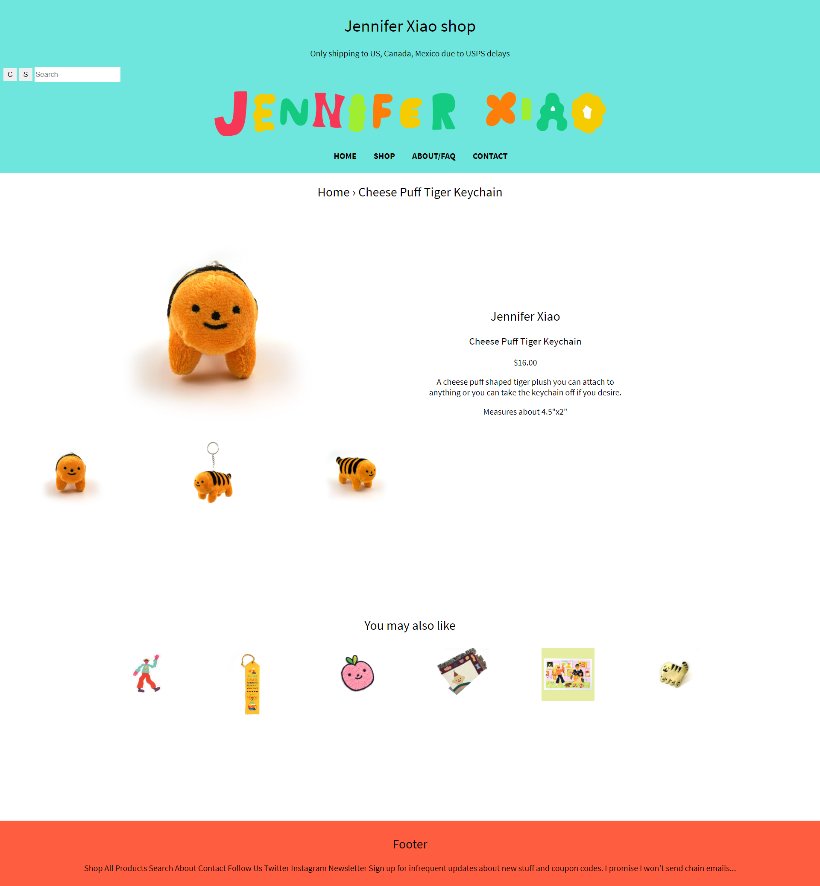
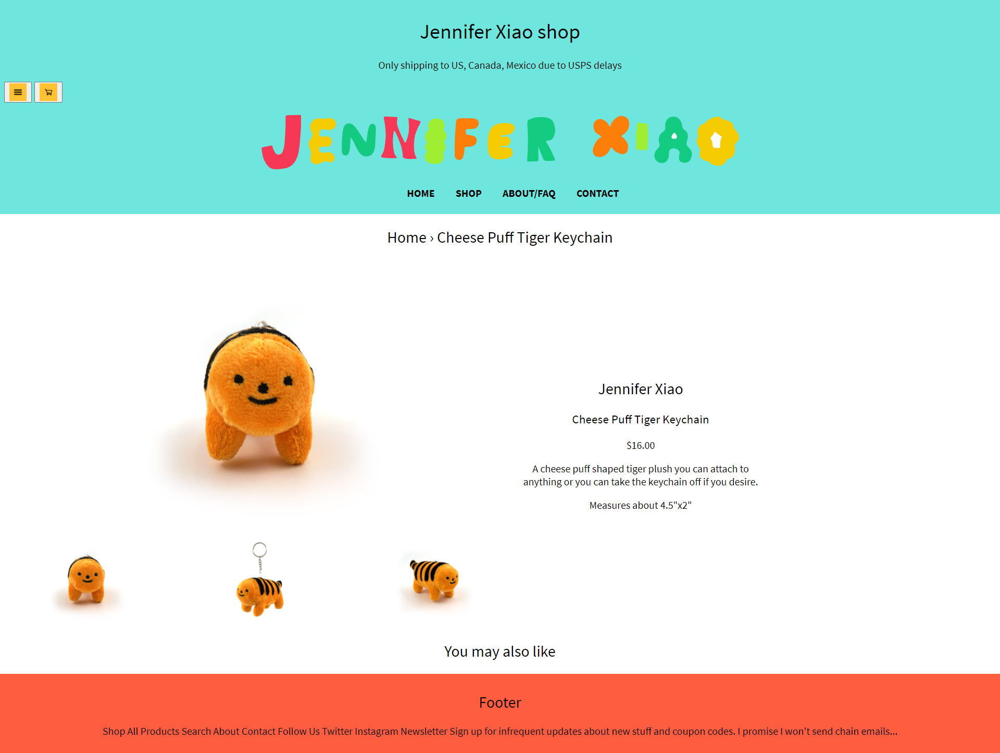
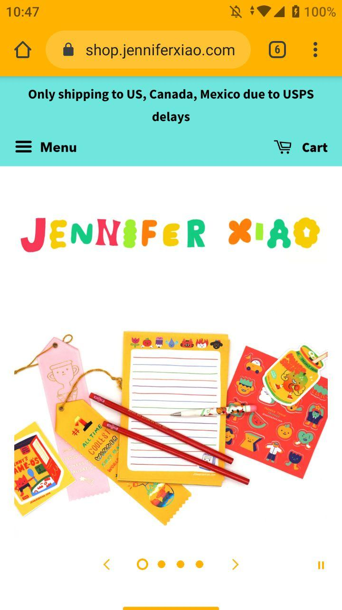
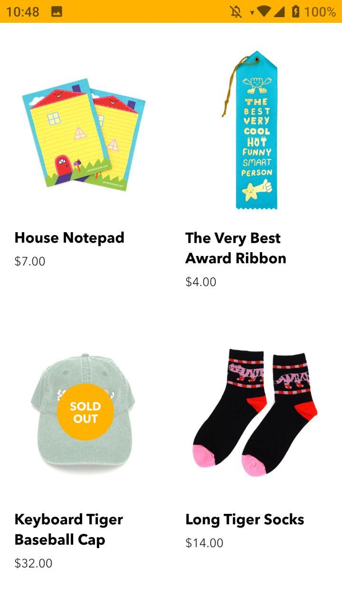
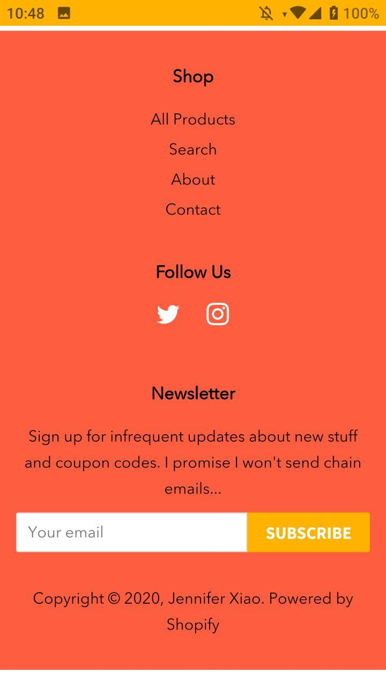
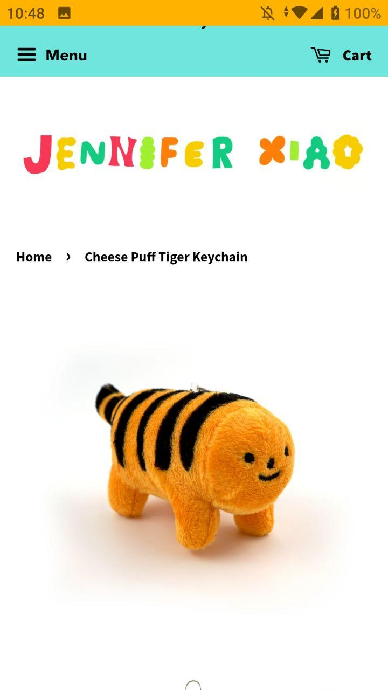

# Procesverslag
**Auteur:** -Amanda Kool-

Markdown cheat cheet: [Hulp bij het schrijven van Markdown](https://github.com/adam-p/markdown-here/wiki/Markdown-Cheatsheet). Nb. de standaardstructuur en de spartaanse opmaak zijn helemaal prima. Het gaat om de inhoud van je procesverslag. Besteedt de tijd voor pracht en praal aan je website.

## Bronnenlijst
1. https://www.w3schools.com/graphics/svg_intro.asp
2. https://css-tricks.com/snippets/css/complete-guide-grid/
3. https://css-tricks.com/introducing-css-scroll-snap-points/
4. https://www.w3schools.com/howto/

## Eindgesprek (week 7/8)

Uiteindelijk heb ik nog veel moeite gehad met mijn javascript werkend krijgen voor mijn eindwebsite, ik heb ontzettend veel tijd hieraan besteed.
Ik heb de javascript in 2 delen gemaakt voor de twee carrousels in het eind.
Ook heb ik de laatste puntjes op de i gezeet door middel van buttons en invulvelden toe te voegen met een paar focus elementen.

**Screenshot(s):**

## Voortgang 3 (week 6)

### stand van zaken

### Agenda voor meeting
- Amanda: Button een image geven, vragen over postioneren
- Sabine: Stylen van form elementen
- Noah en cas: vraag hamburger menu mobiel naar volledig menu op desktop

### Verslag van meeting

De foto's van de buttons zijn nu correct geplaatst in de CSS. Er is verder niet veel extra verteld over mijn pagina, wel heb ik meegekregen hoe er een tab index aangemaakt moet worden en zal ik dit voor mijn volgende ontwerp meenemen.

## Voortgang 2 (week 5)

### Stand van zaken

Ik ben redelijk tevreden met de main pagina, alhoewel nog niet alles in orde is. De instagram carrousel is nog steeds niet bestaand en de andere carrousels die met javascript werken zijn buggy en hebbe her-overweging nodig. Wel ben ik blij met hoe de grid en responsive-heid werkt van de algehele pagina.

### Agenda voor meeting

We gaan op alfabetische volgorde onze lastige punten af.
lastige punten:
-buttons
-grid
-hover elementen
-draggable elementen
-nav bar

### Verslag van meeting

Ik heb een tip gekregen over een hamburger menu te maken en hoe de navigatie bar verebtered kan worden. De foto's die momenteel in de buttons staan kunnen beter in de CSS als achtergrond element staan. Er stond een div op een section die ook onnodig was, deze is nu verwijderd.
Voor de carrousels moet ik kijken voor een andere code en ze moeten beter opgemaakt worden. Twee .js file's zijn overbodig en de arrays kunnen beter in één bestand samengevoegd worden.

## Voortgang 1 (week 3)

### Stand van zaken

Ik ben tevreden met hoe responsive de site tot nu toe is. Wat mij lastig afgaat is de foto's scalen en op de juiste posititie zetten.
Ook wil ik nog in de header wat items doen, maar weet ik nog niet zeker hoe dit werkt. 

**Screenshot(s):**

### Agenda voor meeting

We gaan op alfabetische volgorde onze lastige punten af.
lastige punten:
-tekst toevoegen onder afbeeldingen
-HTML markup

### Verslag van meeting

Er is vertelt hoe je navigatie menus beter kan maken, deels door gebruik te maken van SVG afbeeldingen die hun kwaliteit behouden en beter responsive zijn. 
Verder is er een nadruk gelegt over het belang van buttons te gebruiken voor klikbare elementen - omdat deze makkelijker te gebruiken zijn (geen Javascript nodig) én toetsenbord vriendelijk zijn.
Ook is er kort gesproken over carrousels en hoe dit makkelijker gedaan kan worden door middel van X-scroll te gebruiken in de CSS, zo hoeft er niet een totale javascript aangemaakt te worden (zoals ik heb gedaan).
Aan mij is uitgelegt dat mijn code niet helemaal klopte i.v.m. de headings (dit is nu aangepast). 
Ook is mij verteld hoe ik mijn tekst bij mijn afbeelding kan doen door middel van articles te gebruiken. (immedels ook aangepast).

Ten slotte heb ik meegekregen dat ik het logo van de website een klikbaar plaatje kan maken, zodat een gebruiker direct terug zou komen op de main pagina.

## Intake (week 1)

**Je startniveau:** -blauw- Ik heb nog niet veel ervaring met HTML en CSS en wil het rustig aan doen.

**Je focus:** -responsive-

**Je opdracht:** -Jennifer Xiao (Shop) https://shop.jenniferxiao.com/ ( main website  https://www.jenniferxiao.com/ ) -

**Screenshot(s):**

**Breakdown-schets(en):**

